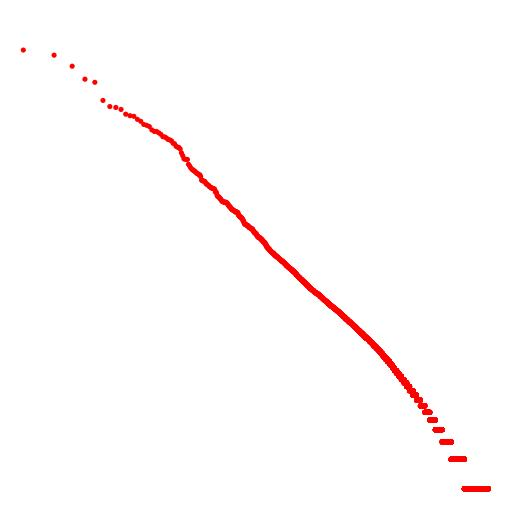

##Text Property Visualization

This program verifies the text properties like Heap's and Zipf's law using content of the given file.The learning of these two laws are very usefule to scale the search engine efficiently.

#####`Zipf's Law`This law states that multiplication of frequency of particular word and non increasing sorted rank of that word based on frequency is always some constant k for that particular corpus.

                                          f . r=k
                                                   where f=frequency of that word.
                                                         r=non increasing sorted rank based on frequency.
                                                         k=constant.
                                                         
#####By this law we can learn that stop words like a, the appears large fration of the text.So, by not storing them we can significantly reduce the size of our indexing and can improve the performance.

Screen Shot For Visualization of Zipf's Law:

